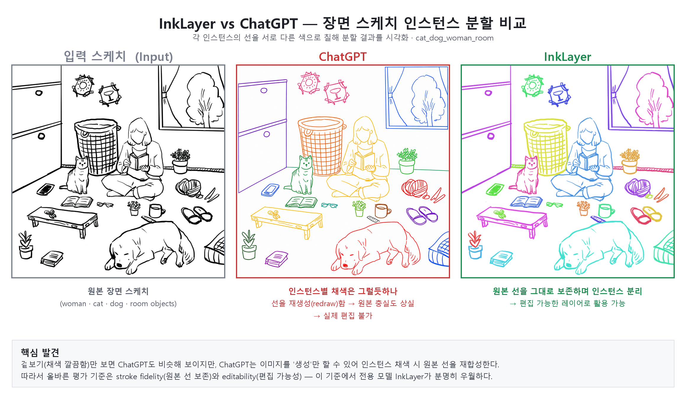

# InkLayer vs 범용 LLM — 장면 스케치 인스턴스 분할 비교

SIGGRAPH 2025 논문 InkLayer가 수행하는 장면 스케치 인스턴스 분할 과제를, 범용 멀티모달 LLM인 ChatGPT와 Gemini가 같은 입력에서 얼마나 해내는지 비교한 실험 기록임.

## 동기

목표 분야는 컴퓨터비전과 컴퓨터그래픽스, 특히 스케치를 편집 가능한 레이어로 분리해 시각 디자인 워크플로우를 자동화하는 방향임. 이 과제를 전용 모델과 범용 LLM 중 무엇이 더 잘 수행하는지 직접 확인하고자 비교 실험을 진행함.

## 비교 대상

비교 기준선은 InkLayer의 출력임. InkLayer는 자연 이미지의 사전지식을 스케치 도메인에 적응시켜 래스터 장면 스케치를 인스턴스 단위로 분할하고, 결과를 정렬된 레이어로 분해하며 가려진 영역을 인페인팅해 편집 가능한 레이어를 만드는 방법론임.

## 실험 구성

- 자체 테스트셋 수집. character, landscape, normal person, object 등 콘텐츠 유형별로 스케치를 수집·분류해 일반화를 점검했고, 각 이미지의 출처와 전처리, 프롬프트를 문서화했으며, 평가 타당성을 위해 AI 생성 이미지를 지양하는 정책에 따라 일부를 폐기함.
- 동일한 장면에 대해 ChatGPT와 Gemini에 인스턴스 단위로 분리해 색을 입히라는 과제를 주고, InkLayer 출력과 나란히 비교함.

## 핵심 비교

각 인스턴스의 선을 서로 다른 색으로 칠해 분할 결과를 시각화함. 겉보기에는 채색이 깔끔해 ChatGPT도 비슷해 보이지만, ChatGPT는 이미지를 생성만 할 수 있어 인스턴스 채색 과정에서 원본 선을 다시 그려냄. 그 결과 손그림의 디테일이 바뀌고 출력으로 원본을 편집할 수 없음. 반면 InkLayer는 원본 선을 그대로 보존하며 인스턴스를 분리해, 편집 가능한 레이어로 활용할 수 있음.

## 평가 기준

단순한 보기 좋음이 아니라 과제의 본질에 맞는 기준을 세움.

| 기준 | 설명 |
| --- | --- |
| Instance Separation | 객체가 올바르게 개별 인스턴스로 분리되는가 |
| Stroke Fidelity | 원본 스케치의 선을 그대로 보존하는가 |
| Editability | 출력으로 원본 레이어를 실제로 편집할 수 있는가 |
| Occlusion Handling | 가려진 영역을 적절히 처리하고 복원하는가 |

## 발견

겉보기 품질에 속지 않고 stroke fidelity와 editability를 기준으로 보면, 범용 LLM은 재생성이라는 구조적 한계 때문에 이 과제에 부적합하고 전용 모델인 InkLayer가 분명히 우월함. 즉 이 비교의 진짜 교훈은 어떤 모델이 이기는가보다 과제에 맞는 올바른 평가 기준을 설계해야 차이가 드러난다는 점임.

## 한계

- 현재 비교는 소수 장면의 정성 평가에 그침. 더 많은 장면으로 확장하고 인스턴스 개수 정확도, 충실도, 누락 및 환각 수 등 정량 지표를 표로 채점할 예정임.
- LLM은 픽셀 마스크를 출력할 수 없고 이미지를 생성만 하므로, 비교는 이 구조적 한계를 전제로 공정하게 해석해야 함.

## 출처

본 비교는 학습과 평가 목적이며, InkLayer 방법론의 원저작권은 원저자에게 있음.

- 논문: Tang, Vinker, Yan, Zhang, Agrawala, *Instance Segmentation of Scene Sketches Using Natural Image Priors*, SIGGRAPH 2025 — [arXiv:2502.09608](https://arxiv.org/abs/2502.09608)
- 공식 구현: https://github.com/miatang13/InkLayer

테스트셋 원본 이미지는 저작권 문제로 본 저장소에 포함하지 않으며, 출처와 전처리 기록은 로컬에서 별도로 관리함. 위 비교 이미지는 분석과 논평 목적의 결과물임.
